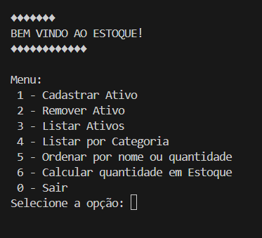
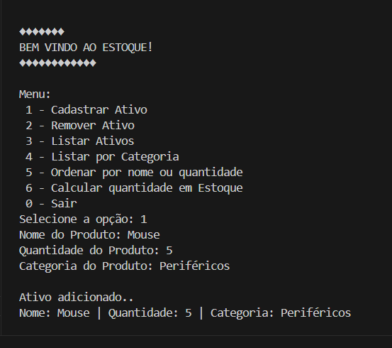
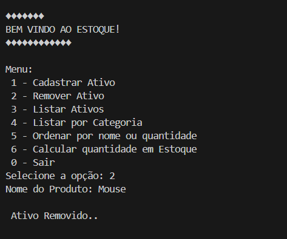
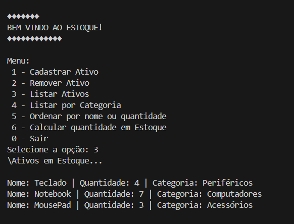
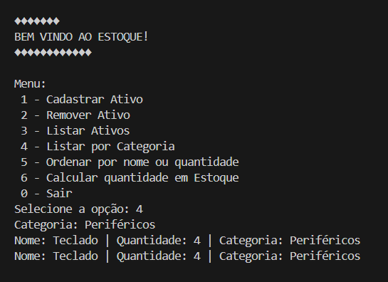
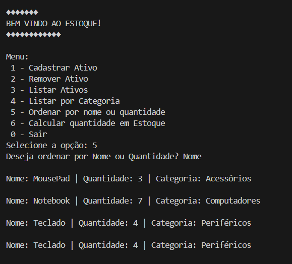
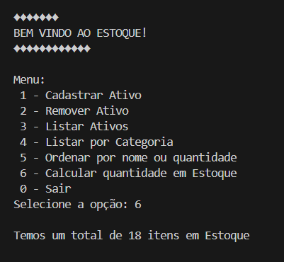

# Sistema De Controle De Estoque (Simples Com Listas) Em Python 🐍

## 📝 DESCRIÇÃO
Este é um sistema simples para controle de estoque em Python, utilizando listas para armazenar os dados. A motivação para desenvolver esse sistema foi praticar os conhecimentos adquiridos no Capítulo 4 do curso de Python aplicado à Análise e Ciência de Dados da DSA. Acredito que criar desafios práticos para aplicar o conteúdo aprendido é o melhor caminho para construir uma base sólida. Neste projeto, utilizei funções (incluindo lambda), listas e interações com o usuário via terminal.

## 🛠️ FUNCIONALIDADES
As principais funções deste sistema são:

1. Cadastro de Ativo no Estoque: 
    Armazena em cada listas paralelas (nomes, quantidades, categorias) os dados de um ativo por vez.
2. Listagem dos Ativos Cadastrados: 
    Apresenta na tela (terminal) os dados dos ativos já cadastrados com suas respectivas quantidades e categoria.
3. Remover Ativos do Estoque: 
    Remove um ativo do estoque a partir do seu nome, eliminando os dados correspondentes nas três listas.
4. Ordenação dos Ativos por Nome ou Quantidade: 
    Ordena os ativos de forma crescente, seja por Nome ou Quantidade em estoque.
5. Filtragem por Categoria:
    Apresenta os ativos cadastrados conforme sua respectiva categoria
6. Cálculo dos Ativos em Estoque:
    Apresenta um somatório da quantidade de todos os ativos em estoque.
7. Menu Interativo em Loop:
    Compõe um Menu interativo e bem intuitivo em loop com opção para encerrar a aplicação.

## ▶️ COMO EXECUTAR

### Pré-requisitos
Antes de começar, você precisa ter instalado:
- Python 3.8+
- Um terminal ou prompt de comando
- (Opcional) Um editor de texto como VS Code

### Clonando o Repositório
> git clone https://github.com/Cleybson45/PythonDSA.git
cd PythonDSA/Capítulo\ 4/Desafios

### Executando o Script 🚀
> python "Inventário Simples - Listas.py"

O programa será executado no terminal e apresentará um menu interativo para manipular o estoque.

## 🧪 EXEMPLOS DE USO

### Menu Interativo:

### Cadastro de Ativo:

### Remoção de Ativo:

### Listagem dos Ativos:

### Listagem por Categoria:

### Ordenar Ativo por Nome:

### Calculando Total:

## 🎓 Aprendizados

Este foi o primeiro projeto que consegui concluir desde o início, o que por si só já representa um marco importante. Ao desenvolvê-lo, não só pratiquei conceitos de Python (como listas, funções e interação com o usuário), como também exercitei o uso do Git e do GitHub para versionamento e documentação. A disciplina para seguir até o fim me ensinou muito sobre resiliência — uma habilidade essencial na trajetória de qualquer desenvolvedor.
 